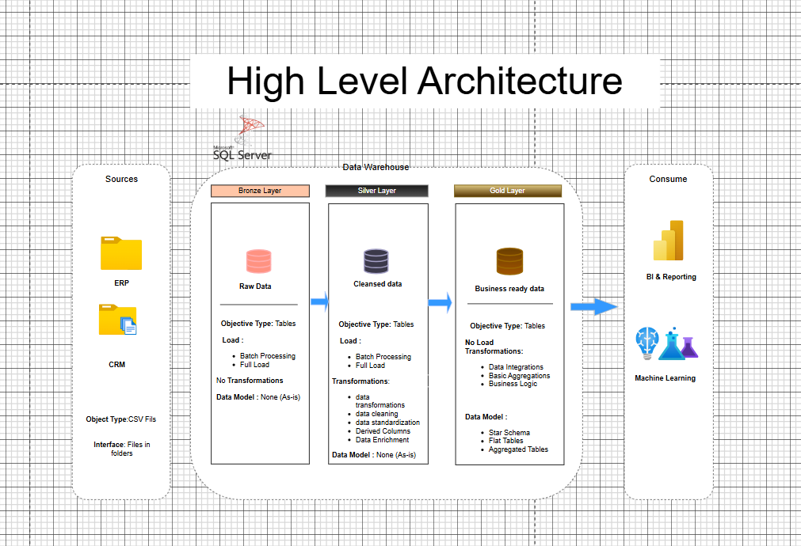

# SQL Data Warehouse Project



## 📋 Table of Contents
- [Overview](#overview)
- [Project Objectives](#project-objectives)
- [Architecture](#architecture)
- [Technologies](#technologies)
- [Project Structure](#project-structure)
- [Data Sources](#data-sources)
- [Data Pipeline](#data-pipeline)
- [Analytics & Insights](#analytics--insights)
- [Testing](#testing)
- [Documentation](#documentation)
- [Contributing](#contributing)
- [License](#license)

## 🎯 Overview

This project demonstrates the design and implementation of a modern data warehouse using SQL Server. It consolidates sales data from multiple source systems (ERP and CRM) into a unified analytical data model, enabling robust reporting and data-driven decision-making.

The project follows the **Medallion Architecture** (Bronze, Silver, Gold layers), which provides a structured approach to data transformation and quality improvement throughout the pipeline.

## 🚀 Project Objectives

- **Data Integration**: Consolidate data from two source systems (ERP and CRM) provided as CSV files
- **Data Quality**: Cleanse, standardize, and resolve data quality issues prior to analytics
- **Unified Data Model**: Merge both systems into a single, user-friendly analytical data model
- **Analytics-Ready**: Create business-ready datasets optimized for reporting and insights
- **Documentation**: Provide comprehensive documentation to support both business stakeholders and analytics teams

## 🏗️ Architecture

The project implements the **Medallion Architecture** with three distinct layers:

### 🥉 Bronze Layer
- **Purpose**: Raw data ingestion
- **Description**: Stores data as-is from source systems with minimal transformation
- **Location**: `scripts/bronze/`
- **Process**: Direct load from CSV files into SQL Server staging tables using 'BULK INSERT'

### 🥈 Silver Layer
- **Purpose**: Data cleansing and transformation
- **Description**: Standardizes, cleanses, and normalizes data for analytical use
- **Location**: `scripts/silver/`
- **Process**: 
  - Data type standardization
  - Handling missing values
  - Deduplication
  - Data validation
  - Business rule application

### 🥇 Gold Layer
- **Purpose**: Analytics-ready data models
- **Description**: Houses business-ready data modeled into a star schema for reporting
- **Location**: `scripts/gold/`
- **Process**: 
  - Dimensional modeling (fact and dimension tables)
  - Aggregations and calculations
  - Optimized for analytical queries

## 🛠️ Technologies

- **Database**: SQL Server (Express, Standard, or Enterprise Edition)
- **Language**: T-SQL, MS SQL
- **ETL**: SQL-based Extract, Transform, Load processes
- **Modeling**: Star Schema dimensional modeling
- **Documentation**: DrawIO for diagrams, Markdown for documentation
- **Version Control**: Git & GitHub

## 📁 Project Structure

```
SQL_Datawarehouse_Project/
│
├── datasets/                    # Raw CSV datasets from source systems
│   ├── ERP data files
│   └── CRM data files
│
├── Scripts/                     # SQL scripts organized by layer
│   ├── bronze/                  # Scripts for raw data ingestion
│   ├── silver/                  # Scripts for data cleaning and transformation
│   └── gold/                    # Scripts for creating analytical models
│
├── docs/                        # Project documentation
│   ├── data_architecture.png    # Architecture diagram
│   ├── data_catalog.md          # Data dictionary and metadata
│   ├── data_models.drawio       # Star schema diagrams
│   ├── data_flow.drawio         # Data flow diagrams
│   ├── etl.drawio               # ETL process diagrams
│   └── naming-conventions.md    # Naming standards
│
├── tests/                       # Data quality and validation tests
│   └── data_quality_checks.sql  # SQL scripts for testing
│
├── LICENSE                      # MIT License
└── README.md                    # This file
```

## 📊 Data Sources

The project integrates data from two primary source systems:

1. **ERP System**: Enterprise Resource Planning data
   - Product information
   - Sales transactions
   - Inventory data
   - Supplier information

2. **CRM System**: Customer Relationship Management data
   - Customer information
   - Contact details
   - Customer interactions
   - Sales opportunities

All source data is provided in CSV format and stored in the `datasets/` directory.


## 🔄 Data Pipeline

The ETL process follows these key stages:

### Extract
- Load raw data from CSV files into Bronze layer staging tables
- Preserve original data structure and values
- Add metadata columns (load_date, source_system, etc.)

### Transform
- Apply data quality rules in Silver layer
- Standardize data formats and naming conventions
- Handle missing values and duplicates
- Validate data against business rules

### Load
- Populate dimension tables (SCD Type 1 or Type 2 as needed)
- create surrogate keys
- Load fact tables with foreign key references
- Create aggregated tables for performance
- Build analytical views for reporting

## 📈 Analytics & Insights

The data warehouse enables analysis across multiple business dimensions:

- **Sales Performance**: Revenue trends, growth metrics, and forecasting
- **Product Analysis**: Best-selling products, category performance, profitability
- **Customer Insights**: Customer segmentation, retention, lifetime value
- **Time Intelligence**: Year-over-year comparisons, seasonal trends
- **Geographic Analysis**: Regional performance, market penetration


## 🧪 Testing

Data quality and validation scripts are located in the `tests/` directory:

- **Data Quality Checks**: Verify completeness, accuracy, and consistency
- **Referential Integrity**: Ensure foreign key relationships are valid
- **Business Rule Validation**: Confirm data meets business requirements
- **Performance Testing**: Validate query performance on large datasets

Run test scripts regularly to maintain data quality:

```sql
-- Execute test scripts
-- Review results for any failures or warnings
```

## 📚 Documentation

Comprehensive documentation is available in the `docs/` folder:

- **data_architecture.png**: Visual representation of the overall architecture
- **data_catalog.md**: Detailed data dictionary with field descriptions and metadata
- **data_models.drawio**: Star schema and dimensional model diagrams
- **data_flow.drawio**: Data flow diagrams showing ETL processes
- **etl.drawio**: ETL techniques and methodologies
- **naming-conventions.md**: Naming standards for tables, columns, and objects

## 🎓 Skills Demonstrated

This project showcases expertise in:

- ✅ **SQL Development**: Writing optimized T-SQL queries for analytics
- ✅ **Data Engineering**: Designing ETL pipelines for data movement
- ✅ **Data Architecture**: Structuring scalable data warehouse solutions
- ✅ **Data Modeling**: Implementing dimensional models (star schema)
- ✅ **Data Quality**: Ensuring data accuracy, completeness, and consistency
- ✅ **Database Design**: Creating efficient database structures
- ✅ **Documentation**: Providing clear technical and business documentation
- ✅ **Best Practices**: Following industry standards and naming conventions

## 🤝 Contributing

Contributions are welcome! Please follow these steps:

1. Fork the repository
2. Create a feature branch (`git checkout -b feature/AmazingFeature`)
3. Commit your changes (`git commit -m 'Add some AmazingFeature'`)
4. Push to the branch (`git push origin feature/AmazingFeature`)
5. Open a Pull Request

## 📄 License

This project is licensed under the MIT License - see the [LICENSE](LICENSE) file for details.

## 📧 Contact

For questions, suggestions, or collaboration opportunities, please open an issue in this repository.

---

**Note**: This is a portfolio/educational project designed to demonstrate data warehousing concepts and SQL Server development skills. The datasets used are for demonstration purposes only.
